# 🐍 FreePy - Упорядочиваем хаос Python проектов

**"Надоел беспорядок в проектах? FreePy превратит ваш рабочий стол из свалки скриптов в организованное пространство разработки!"**

---

## 😫 Бывало такое?

* 📁 **100500 скриптов** на рабочем столе с именами `test.py`, `test2.py`, `final.py`, `really_final.py`
* 🔍 **Поиск нужного файла** превращается в археологические раскопки
* 📝 **Забыл, какой Python** использовал в проекте полгода назад
* 🔧 **Зависимости потерялись**, а `requirements.txt` давно устарел
* 🐛 **Отладка** через `print()` - это наш "профессиональный" дебаггер
* 🔄 **Версии?** У нас есть `v1_final_edited_new.py`!

**Если да - эта программа для вас!**

---

## ✨ Что такое FreePy?

**FreePy** - это не просто IDE, а ваш **персональный менеджер хаоса** для Python разработки.

Он родился из отчаяния обычного разработчика, уставшего от:
- Быстрых проектов, которые превращались в беспорядок
- Мимолетных скриптов, которые оставались жить вечно
- Собственного разгильдяйства (признаемся честно!)
- И просто потому что "луна не в той фазе"! 🌙

Когда я не нашёл ничего подходящего среди существующих IDE и менеджеров проектов - пришлось **выкручиваться**. Так появился FreePy.

---

## 🖼️ Визуальный тур

### 📊 Панель управления проектами

#### Главное окно - Центр управления хаосом
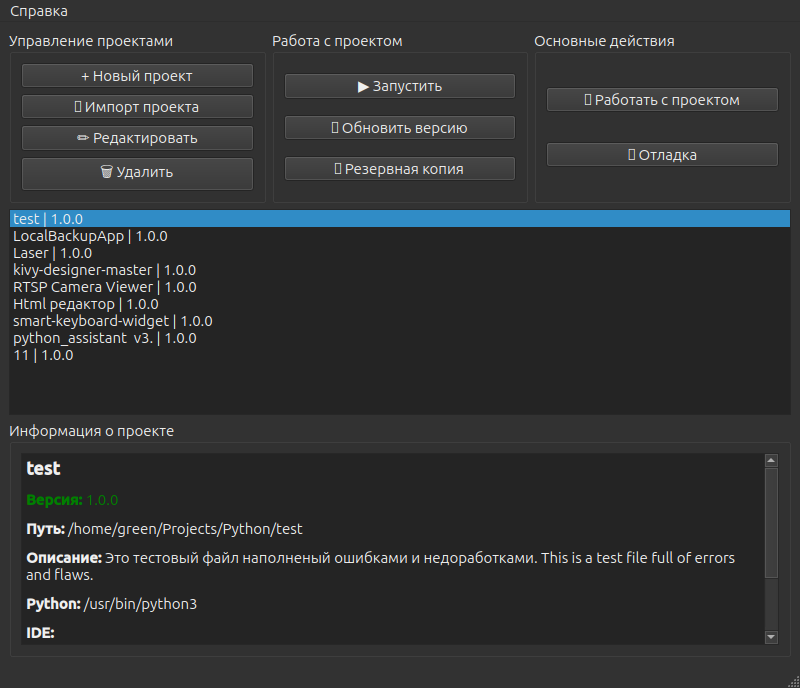
*Ваша стартовая площадка для всех Python проектов. Все проекты организованы, отсортированы и готовы к работе.*

#### Импорт существующего проекта
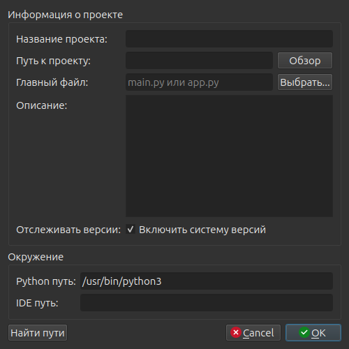
*Просто укажите папку с вашим кодом - FreePy автоматически определит структуру и добавит проект в список.*

#### Редактирование проекта
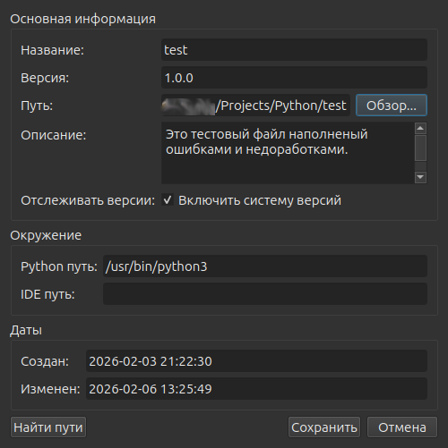
*Обновите пути, измените описание, настройте параметры - всё в одном удобном окне.*

#### Обновление версии проекта
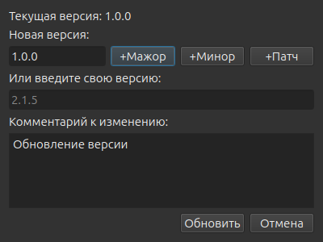
*Интуитивный интерфейс для управления версий. Выберите тип обновления, добавьте комментарий - FreePy всё сделает за вас.*

### ✨ Интеллектуальный редактор кода

#### Редактор с подсветкой синтаксиса (Темная тема)
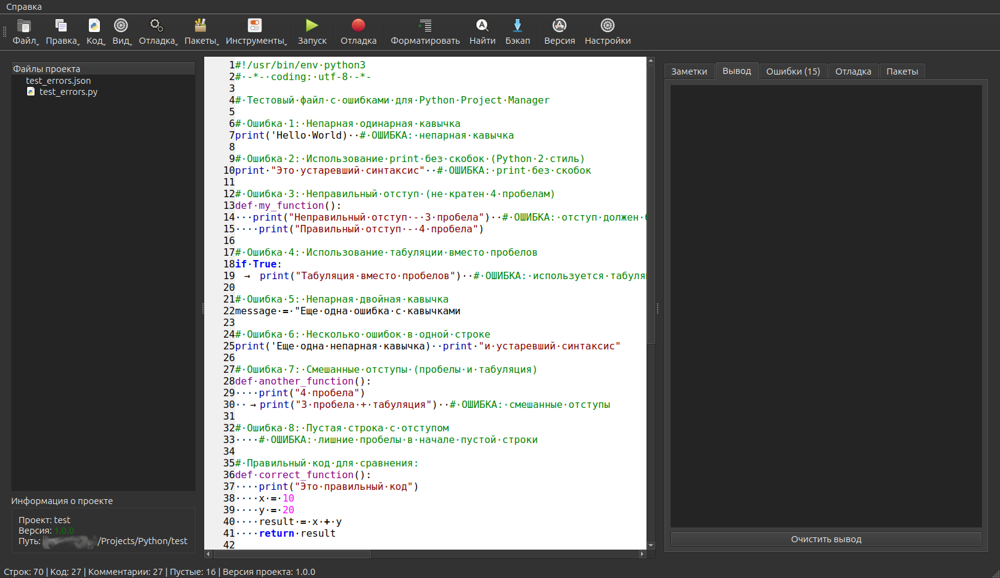
*Профессиональная подсветка Python кода с поддержкой всех современных функций языка.*

#### Удаление комментариев - ДО
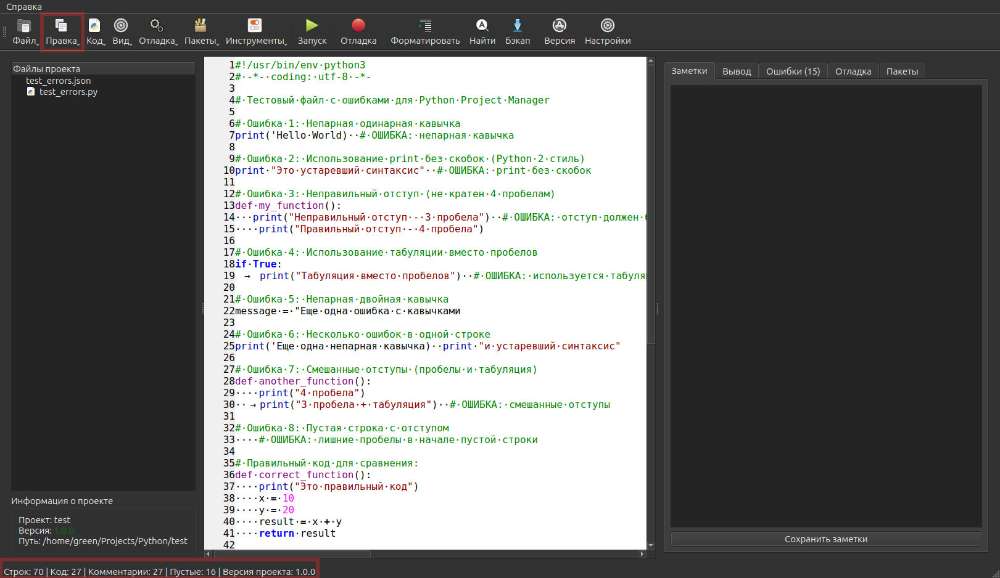
*Захламленный комментариями код, который сложно читать и поддерживать.*

#### Удаление комментариев - ПОСЛЕ

*Чистый, компактный код после автоматического удаления всех комментариев одной кнопкой!*

### 📝 Рабочее пространство

#### Панель заметок проекта
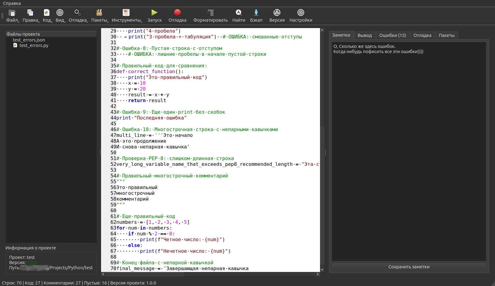
*Встроенный блокнот для каждого проекта. Записывайте идеи, задачи, заметки прямо в редакторе.*

#### Панель вывода программы

*Результаты выполнения вашего кода. Все сообщения, ошибки и отладочная информация в одном месте.*

#### Панель обнаруженных ошибок
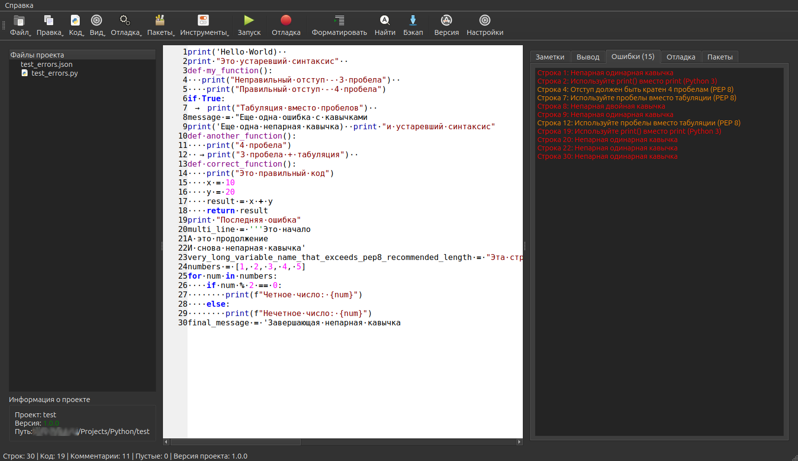
*Автоматическое обнаружение синтаксических ошибок, проблем с PEP 8 и потенциальных багов.*

#### Управление пакетами Python
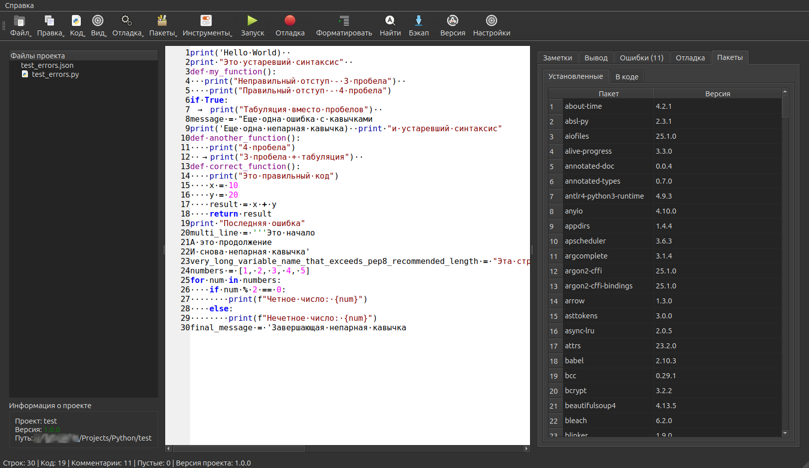
*Интеллектуальное управление зависимостями. FreePy анализирует ваш код и показывает, какие пакеты установлены, а какие нужно добавить.*

### 🐛 Профессиональный отладчик

#### Встроенный отладчик Python
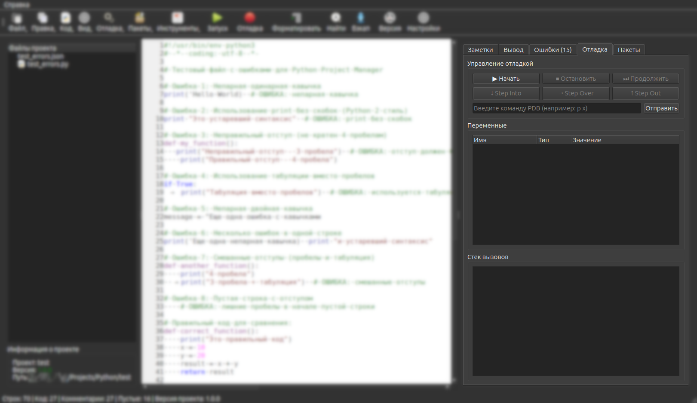
*Полноценная среда отладки с точками останова, просмотром переменных, стеком вызовов и интерактивной консолью.*

#### Управление точками останова
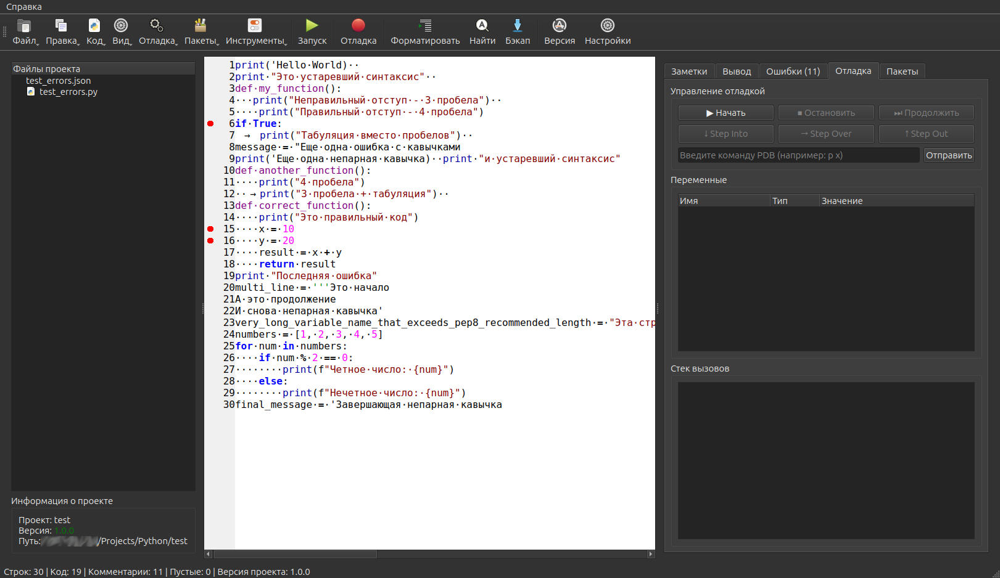
*Легко устанавливайте, настраивайте и управляйте точками останова в вашем коде.*

---

## 🚀 **Скачать FreePy**

### Windows
- **[FreePy_Windows_1.0.0.exe](releases/windows/FreePy_Windows_1.0.0.exe)** (64-bit)
- Требуется: Windows 10/11, .NET Framework 4.8
- !!!В Планах!!!

### macOS
- **[FreePy_macOS_1.0.0.dmg](releases/macos/FreePy_macOS_1.0.0.dmg)** (Apple Silicon & Intel)
- Требуется: macOS 11.0+
- !!!В Планах!!!

### Linux
- **[FreePy_Linux_1.0.0.AppImage](releases/linux/FreePy_Linux_1.0.0.AppImage)** (Universal)
- **[FreePy_Linux_1.0.0.deb](releases/linux/FreePy_Linux_1.0.0.deb)** (Debian/Ubuntu)
- Требуется: Qt5, Python 3.6+

---

## 🎯 **Основные возможности**

### 📁 **Управление проектами**
- **Структурирование** всех ваших Python проектов в одном месте
- **Автоматическое отслеживание** версий проекта (больше никаких `_final_v3.py`)
- **JSON конфигурация** каждого проекта - всегда знаете, что и как запускать
- **Быстрый доступ** ко всем проектам из единого списка

### ✨ **Умный редактор**
- **Подсветка синтаксиса** Python с поддержкой всех фич языка
- **Автодополнение** кода (не нужно помнить каждый метод наизусть)
- **Проверка PEP 8** - ваш код будет чистым и красивым
- **Форматирование** одним кликом
- **Темы**: светлая и темная (для ночных сессий кодинга)

### 🐛 **Встроенный отладчик**
- **Интеграция с PDB** - настоящий дебаггер, а не `print()`
- **Точки останова** обычные и условные
- **Шаг за шагом**: Step Into, Step Over, Step Out
- **Просмотр переменных** в реальном времени
- **Стек вызовов** - видите где находитесь

### 📦 **Управление зависимостями**
- **Автоопределение** импортов в коде
- **Проверка установленных** пакетов
- **Быстрая установка** недостающих зависимостей
- **Никаких забытых** `requirements.txt`

### 🔄 **Система версионирования**
- **Семантическое версионирование** (1.2.3)
- **История изменений** с комментариями
- **Автоматическое обновление** версий при изменениях
- **Откат** к предыдущим версиям

### 💾 **Безопасность и бэкапы**
- **Автосохранение** каждые 30 секунд
- **Автоматические бэкапы** (никогда не потеряете код)
- **Восстановление** из любой резервной копии
- **Проверка безопасности** запускаемых команд

---

## 🎮 **Как пользоваться: Быстрый старт**

### Шаг 1: Создаем проект
1. Нажмите **"Новый проект"**
2. Укажите имя, путь и описание
3. FreePy создаст структуру папок и главный файл
4. Проект автоматически появится в списке

### Шаг 2: Работаем с кодом
1. Выберите проект и нажмите **"Работать с проектом"**
2. Пишите код в редакторе - подсветка и автодополнение работают автоматически
3. Используйте **Ctrl+/** для комментариев, **Tab** для отступов

### Шаг 3: Запускаем и отлаживаем
- **F5** - Запустить код
- **F8** - Запустить отладчик
- **F9** - Поставить/убрать точку останова
- **F10** - Шаг с обходом (Step Over)
- **F11** - Шаг с заходом (Step Into)

### Шаг 4: Управляем версиями
1. После значимых изменений нажмите **"Обновить версию"**
2. Выберите тип обновления (патч/минор/мажор)
3. Добавьте комментарий что изменили
4. FreePy сохранит историей изменений

---

## 🛠️ **Подробное описание кнопок**

### 🏠 **Главное окно:**

| Кнопка | Что делает | Когда использовать |
|--------|------------|-------------------|
| **➕ Новый проект** | Создает новую структуру проекта с папками и файлами | Когда начинаете новый проект с нуля |
| **📁 Добавить проект** | Добавляет существующую папку как проект | Когда у вас уже есть код, но нет структуры |
| **▶️ Запустить проект** | Открывает проект в выбранной IDE или запускает его | Когда хотите продолжить работу или запустить код |
| **✏️ Редактировать проект** | Изменяет настройки проекта | Когда нужно обновить пути или описание |
| **💾 Резервная копия** | Создает zip-архив проекта | Перед рискованными изменениями |
| **🗑️ Удалить проект** | Удаляет проект из списка (не файлы!) | Когда проект больше не нужен |
| **👨‍💻 Работать с проектом** | Открывает полноценный редактор кода | Для серьезной работы над кодом |
| **🐛 Отладить проект** | Открывает проект в режиме отладки | Когда нужно найти баг |
| **🔄 Обновить версию** | Изменяет версию проекта | После значимых изменений |

### ✨ **Редактор кода:**

| Кнопка/Горячая клавиша | Что делает |
|------------------------|------------|
| **F5** | Запустить текущий скрипт |
| **F8** | Начать/остановить отладку |
| **F9** | Установить/снять точку останова |
| **Ctrl+S** | Сохранить файл |
| **Ctrl+F** | Найти в коде |
| **Ctrl+H** | Заменить текст |
| **Ctrl+G** | Перейти к строке |
| **Ctrl+/** | Закомментировать/раскомментировать |
| **Ctrl+Shift+F** | Форматировать код |
| **Ctrl+B** | Создать бэкап |
| **Ctrl+U** | Обновить версию проекта |

---

## ## 📊 **Сравнение: До FreePy и После**
### 🗑️ **До:**
Рабочий стол/
├── test.py
├── test2.py
├── final.py
├── really_final.py
├── project_old/
├── new_idea.py
└── temp_script.py

text
### 🏗️ **После:**
FreePy/
├── Проекты/
│ ├── WebScraper (v1.2.3)
│ ├── DataAnalysis (v2.0.0)
│ ├── ML_Model (v1.5.0)
│ └── API_Service (v3.1.0)
└── Резервные копии/

---

## 📦 Управление зависимостями
FreePy автоматически анализирует ваш код и показывает:

✅ Установленные пакеты - уже есть в системе
⚠️ Неустановленные пакеты - используются в коде, но не установлены
🔧 Быстрая установка - одним кликом установите недостающие пакеты

Пример:
Если ваш код содержит import requests, но requests не установлен, FreePy предложит установить его прямо из интерфейса!

🔄 Система версионирования
Поддерживает семантическое версионирование:
MAJOR (1.0.0 → 2.0.0) - несовместимые изменения API

MINOR (1.0.0 → 1.1.0) - новая функциональность с обратной совместимостью

PATCH (1.0.0 → 1.0.1) - исправления ошибок

---

## 💾 Безопасность и бэкапы
Автоматические бэкапы:
⏰ Каждые 30 секунд - автосохранение изменений

📁 При закрытии - резервная копия при выходе

🔄 Перед обновлением версии - сохранение предыдущего состояния

🗂️ Организованное хранение - все бэкапы в одной папке

Восстановление:
Откройте меню "Файл"

Выберите "Загрузить из резервной копии"

Выберите нужную версию

FreePy восстановит файл

---

❓ Часто задаваемые вопросы
🤔 FreePy удаляет мои файлы?
Нет! FreePy только организует их. Все исходные файлы остаются на своих местах.

🔒 Безопасно ли это?
Да! FreePy использует только локальные операции и не отправляет данные в интернет.

💰 Это бесплатно?
Абсолютно! FreePy - проект с открытым исходным кодом под лицензией MIT.

🐍 Нужен ли Python?
Для базовых функций не нужен, но для запуска скриптов и отладки потребуется Python 3.6+.

📱 Есть ли мобильная версия?
Пока нет, но в планах есть версия для iPadOS.

🐛 Нашли ошибку?
Проверьте существующие issues

Создайте новый issue с подробным описанием

Приложите скриншоты и шаги для воспроизведения

💖 Поддержать проект
FreePy разрабатывается в свободное время. Если проект вам помог:

⭐ Поставьте звезду на GitHub

🐛 Сообщайте об ошибках

💡 Предлагайте идеи

🔄 Расскажите друзьям

📄 Лицензия
FreePy распространяется под лицензией MIT. Подробности в файле LICENSE.

👨‍💻 Автор
GryfGreen - разработчик, который устал от хаоса в Python проектах.

GitHub | Telegram | Email

🎉 Начните упорядочивать свой код сегодня!
Скачайте FreePy прямо сейчас и навсегда избавьтесь от хаоса в Python проектах! 🚀

⬇️ Скачать для Windows 
### Windows
- **[FreePy_Windows_1.0.0.exe](releases/windows/FreePy_Windows_1.0.0.exe)** (64-bit)
- Требуется: Windows 10/11, .NET Framework 4.8
⬇️ Скачать для macOS 
### macOS
- **[FreePy_macOS_1.0.0.dmg](releases/macos/FreePy_macOS_1.0.0.dmg)** (Apple Silicon & Intel)
- Требуется: macOS 11.0+
⬇️ Скачать для Linux 
### Linux
- **[FreePy_Linux_1.0.0.AppImage](releases/linux/FreePy_Linux_1.0.0.AppImage)** (Universal)
- **[FreePy_Linux_1.0.0.deb](releases/linux/FreePy_Linux_1.0.0.deb)** (Debian/Ubuntu)
- Требуется: Qt5, Python 3.6+

P.S. Ваш будущий я скажет вам спасибо, когда через полгода вы сможете найти и запустить любой свой проект за 30 секунд! 😉

